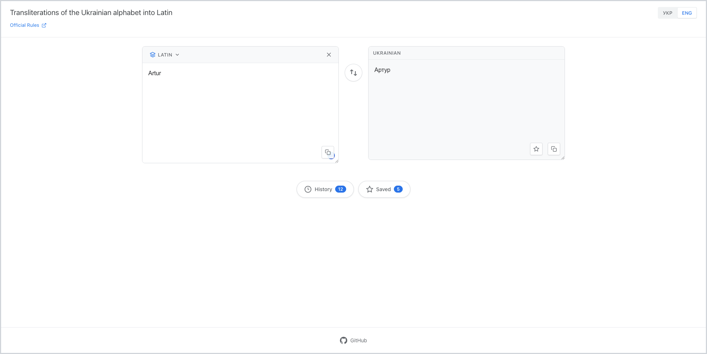
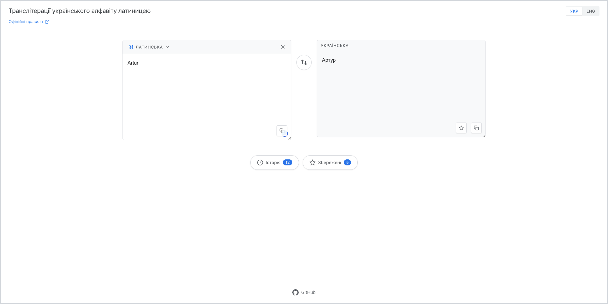
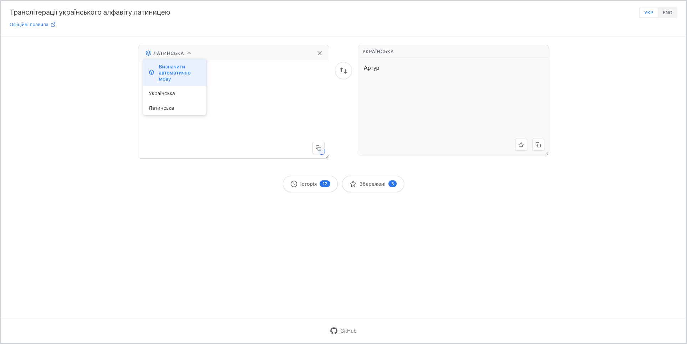
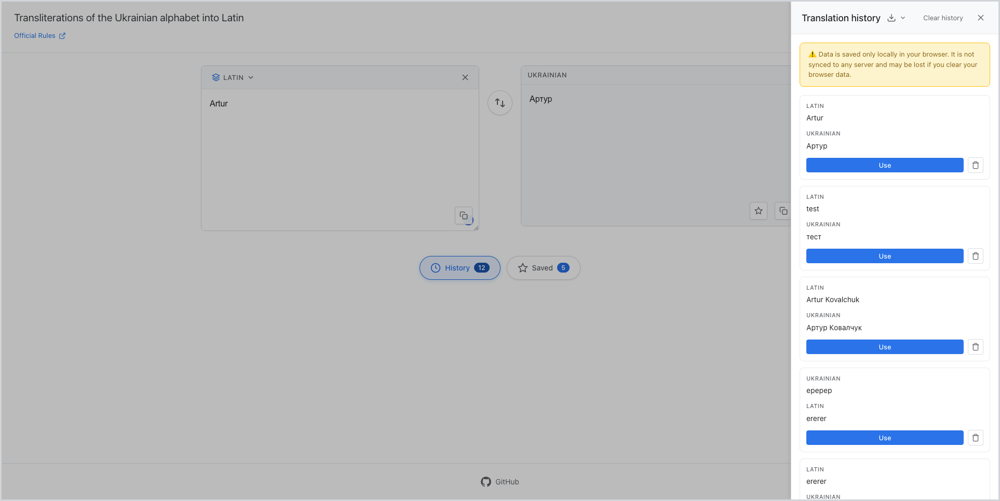
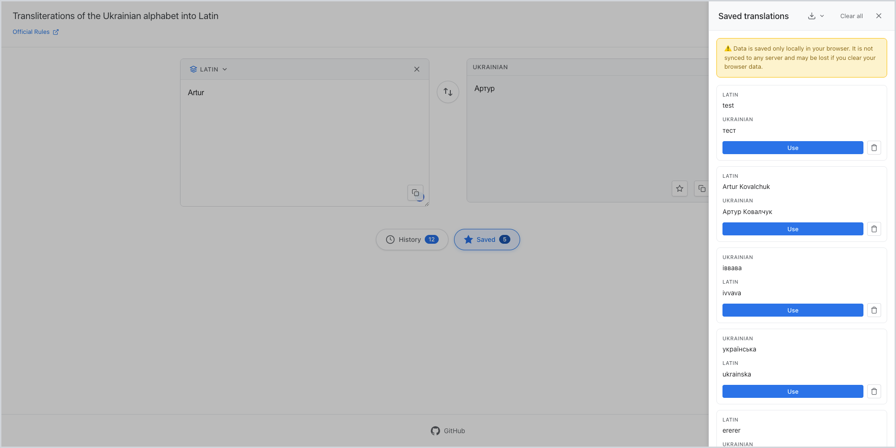

# Інструмент транслітерації української мови

> [🇬🇧 Read in English](README.md)

Сучасний веб-додаток для транслітерації українського тексту латиницею та навпаки, що дотримується офіційних правил транслітерації української мови.

## Можливості

- **Двонаправлена транслітерація**: Конвертуйте український текст латиницею та латиницю назад в український
- **Автовизначення**: Автоматично визначає мову введення та вибирає відповідний напрямок транслітерації
- **Ручний вибір мови**: Виберіть між українською, латиницею або режимом автовизначення
- **Історія перекладів**: Автоматично зберігає історію ваших перекладів для швидкого доступу
- **Збережені переклади**: Зберігайте часто використовувані переклади для легкого повторного використання
- **Функція експорту**: Експортуйте збережені переклади та історію у форматі JSON або CSV
- **Двомовний інтерфейс**: Підтримує як українську (УКР), так і англійську (ENG) мови
- **Відповідність офіційним правилам**: Дотримується офіційних правил транслітерації української мови

## Скріншоти

### Головний інтерфейс трансляції (Англійська)



### Головний інтерфейс трансляції (Українська)



### Випадаюче меню автовизначення мови



### Панель історії перекладів



### Панель збережених перекладів



## Початок роботи

### Вимоги

- Node.js (версія 18 або вища)
- npm або yarn

### Встановлення

1. Клонуйте репозиторій:
```bash
git clone https://github.com/artur-kovalchuk-toolkit/translit-ua-lang.git
cd translit-ua-lang
```

2. Встановіть залежності:
```bash
npm install
```

3. Запустіть сервер розробки:
```bash
npm run dev
```

4. Відкрийте браузер та перейдіть за адресою `http://localhost:5173`

### Збірка для продакшну

```bash
npm run build
```

Збірка для продакшну буде в директорії `dist`.

## Використання

1. **Введіть текст**: Введіть або вставте ваш текст у поле введення
2. **Автовизначення**: Додаток автоматично визначає мову та транслітерує відповідно
3. **Ручний вибір**: Натисніть селектор мови, щоб вибрати українську, латиницю або автовизначення
4. **Зміна мов**: Використовуйте кнопку обміну, щоб поміняти місцями вхідний та вихідний текст
5. **Збереження перекладів**: Натисніть іконку зірки, щоб зберегти часто використовувані переклади
6. **Перегляд історії**: Натисніть кнопку Історія, щоб побачити історію ваших перекладів
7. **Експорт даних**: Експортуйте ваші збережені переклади або історію у форматі JSON або CSV

## Технічний стек

- **React 19** - UI фреймворк
- **TypeScript** - Типізація
- **Vite** - Інструмент збірки та dev сервер
- **React Router** - Маршрутизація (за потреби)

## Офіційні правила

Цей інструмент дотримується офіційних правил транслітерації української мови, встановлених Кабінетом Міністрів України. Для отримання додаткової інформації відвідайте [офіційний документ](https://zakon.rada.gov.ua/laws/show/55-2010-%D0%BF#Text).

## Внесок у проект

Внесок у проект вітається! Будь ласка, не соромтеся надсилати Pull Request.

## Ліцензія

Цей проект є відкритим програмним забезпеченням та доступний під ліцензією MIT.

## Посилання

- [Репозиторій GitHub](https://github.com/artur-kovalchuk-toolkit/translit-ua-lang)
- [Офіційні правила транслітерації](https://zakon.rada.gov.ua/laws/show/55-2010-%D0%BF#Text)

